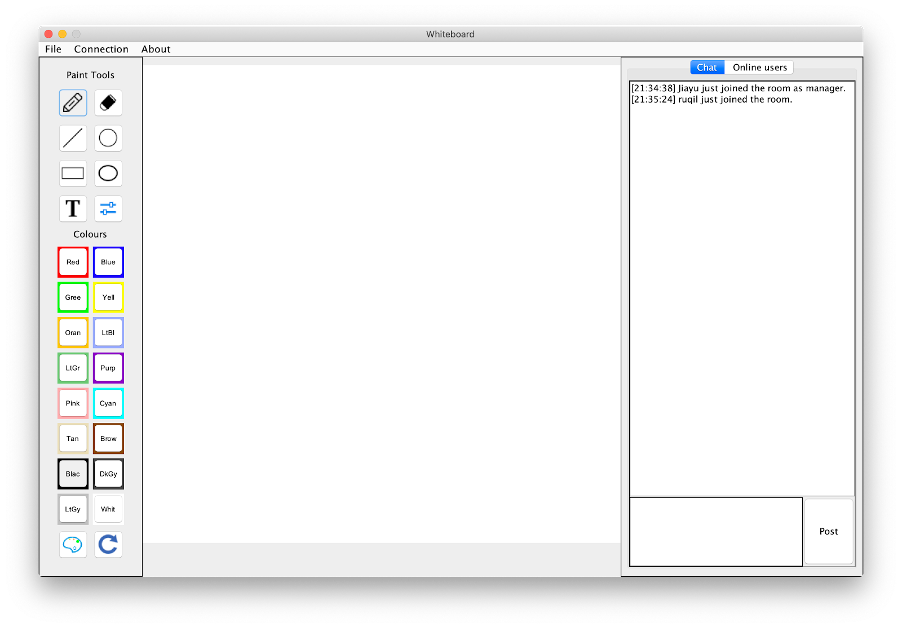
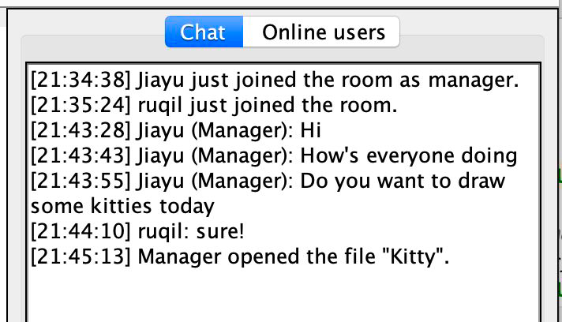

# Collaborative Whiteboard

This is a shared whiteboard that allows multiple users to draw simultaneously on a canvas. 

## Functionalities

- Multiple users can draw on a shared canvas concurrently
  - Free drawing and eraser with customisable size
  - Drawing lines, circles, rectangles and ovals
  - Inputting texts
  - Choose colours to draw the above features

- Text-based chat window

- "File" menu with new, open, save, save as and close (only the manager can control this)

## Running the program

The first user creates a whiteboard and becomes the whiteboard’s manager:

`java -jar ManagerWhiteboard <serverIP> <serverPort>`

Other users can join the whiteboard by inputting server’s IP address and port number:

`java -jar JoinWhiteBoard <serverIP> <serverPort>`
